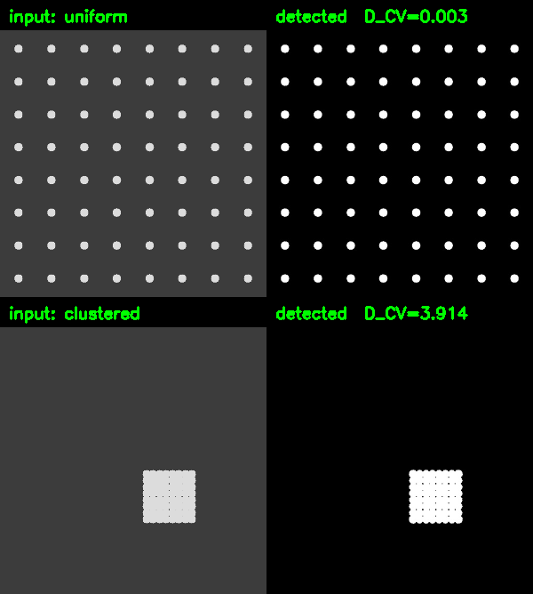

# dcv-vision

**Turn a microscope photo into a dispersion-uniformity number.**

A small computer-vision pipeline that extracts quadrat D_CV — the
coefficient of variation of particle coverage across a grid — from a
micrograph. Built for the same thermal-interface-material project as
[formulation-bo](https://github.com/mthogeon0731/formulation-bo): that
library needed a dispersion number as an input, and grading it by eye from
a photo doesn't scale or reproduce.



---

## The problem it solves

Filler dispersion in a composite — how evenly the particles are spread
through the matrix, not just how many there are — matters for thermal and
mechanical properties, but "how evenly" isn't something you can read off a
photo consistently by eye, and doing it by hand doesn't scale past a
handful of samples.

This pipeline takes a raw micrograph and returns a single number: split the
frame into an N×N grid, measure the particle area fraction in each cell,
and take the coefficient of variation across cells. Uniform dispersion —
similar coverage everywhere — gives a low D_CV. Clustering — some cells
packed, others empty — gives a high one, and it isn't clipped at 1, because
severe clustering should be allowed to say so.

## How it works

1. **Fixed-scale resize.** Every image is resized to a fixed long-edge
   pixel count before anything else runs. Every downstream kernel is sized
   in pixels, so the scale has to be locked first or those constants mean
   a different thing on every photo.
2. **Symmetric background correction + polarity detection.** Illumination
   is corrected with morphological top-hat (bright particles) *and*
   black-hat (dark particles) in parallel — using only top-hat makes dark
   particles structurally undetectable. Whichever channel has higher
   contrast (std of the corrected image) is taken as the particle channel.
   Contrast, not raw connected-component count: counting components on the
   losing channel was flipping polarity in practice, because a flat,
   particle-free background still degenerates to a near-zero Otsu threshold
   and floods that channel with single-pixel morphology noise, whose count
   can outnumber the real particles on the winning channel.
3. **Otsu threshold + morphological cleanup**, discarding connected
   components below a minimum pixel area as noise.
4. **Quadrat D_CV** over an N×N grid (default 8×8), unclipped.

## Try it

```bash
git clone https://github.com/mthogeon0731/dcv-vision
cd dcv-vision
pip install -r requirements.txt
python demo.py
```

It builds two synthetic micrographs in-code (evenly spaced particles vs.
particles packed into one corner — no lab equipment needed), runs the
pipeline on both, and writes `demo_dispersion.png`. On the synthetic
fixtures: uniform → D_CV ≈ 0.003, clustered → D_CV ≈ 3.91.

To try it over HTTP instead of calling the function directly:

```bash
uvicorn api:app --reload --host 127.0.0.1
# POST an image file to http://localhost:8000/analyze-microscope
```

`--reload` is for local development only. `api.py` has no auth and no rate
limiting — it's safe to run against yourself, but don't expose it to the
internet without putting auth, a rate limit, and a body-size limit (e.g.
nginx `client_max_body_size`) in front of it.

## Tests

```bash
python tests/test_dcv.py
```

No test framework required. Covers detection ordering (uniform < clustered),
determinism, the unclipped-scale case, two error paths (non-image input,
particle-free input), polarity symmetry (bright vs. dark particles resolve
to the same D_CV), original-resolution passthrough, that the header-based
pixel-cap check actually fires before cv2 decodes anything, and the HTTP
endpoint (including its Content-Length and upload-size guards).

## Use it on your own problem

```python
from dcv_vision import analyze_micrograph

with open("micrograph.jpg", "rb") as f:
    result = analyze_micrograph(f.read())

print(result["d_cv"], result["polarity"], result["area_fraction"])
```

`analyze_micrograph()` is a pure function — bytes in, dict out. No storage,
no framework dependency. `api.py` is an optional stateless FastAPI wrapper
around it.

## Notes and limits

- **Grayscale, single-channel particles only.** No color or multi-phase
  segmentation.
- **Kernel constants are provisional.** `TOPHAT_KERNEL_PX`,
  `MORPH_OPEN_KERNEL_PX`, and `MIN_PARTICLE_AREA_PX` in
  `dcv_vision/config.py` are derived from a capture SOP's px/µm ratio, not
  yet confirmed by eye against a real micrograph. They're clearly marked in
  the source; treat them as a starting point for your own optics, not a
  calibrated constant.
- **No batching.** One image in, one result out.
- **Untrusted-upload guards, not a full hardening job.** Decompression
  bombs (a small file that decodes to a huge canvas) are rejected by
  `dcv_vision._peek_image_size`, which reads width/height from the raw
  PNG/JPEG header bytes *before* `cv2.imdecode` runs — checking the
  decoded array's shape is too late, since decoding it is the expensive
  part. (`analyze_micrograph` also has a post-decode size check as a
  fallback for formats the header parser doesn't recognize, but that one
  can't stop the decode itself.) OpenCV's own
  `OPENCV_IO_MAX_IMAGE_PIXELS` env var looked like it would help here too,
  but it's latched at cv2's native-extension load time rather than at
  first decode — setting it from Python after `import cv2` has run
  anywhere in the process is a no-op, confirmed empirically, so this
  library doesn't rely on it.
  On the request side, `api.py` rejects on a declared `Content-Length`
  over 10MB before Starlette parses the multipart body, and separately
  caps how much its own handler buffers. Neither one is a substitute for a
  body-size limit at the reverse proxy / platform level: a client that
  omits `Content-Length` (chunked transfer-encoding) or simply lies about
  it isn't caught by either.

## Built with

Python, OpenCV, NumPy, FastAPI.

## License

MIT
