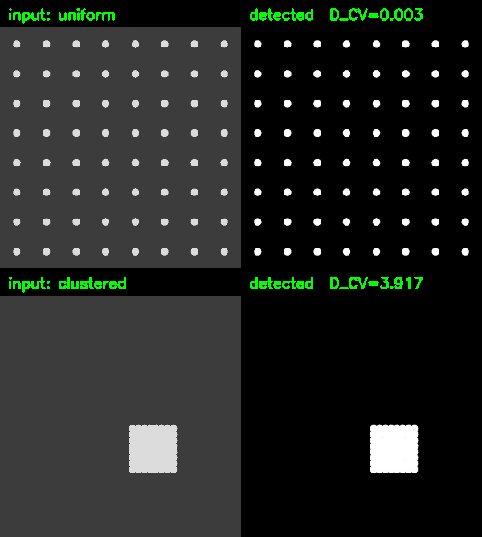

# dcv-vision

**Turn a microscope photo into a versioned dispersion-uniformity number.**

A small OpenCV pipeline for the same thermal-interface-material project as
[formulation-bo](https://github.com/mthogeon0731/formulation-bo).
It divides a micrograph into an 8 x 8 grid and measures how unevenly a phase
is distributed. Low D_CV means similar coverage across cells; larger values
mean more spatial variation. Values are not clipped at 1.

## Definition v2

**v2 changes the scientific definition. Do not pool v1 and v2 values or
compare them as if only the implementation changed.** Reanalyze original
images with a consistent definition and particle polarity when migrating.
Save dcv_version, minority_phase, and polarity alongside d_cv.

For each cell, let p_i be its particle area fraction. If overall particle
coverage is at most 50%, use q_i = p_i; otherwise use q_i = 1 - p_i
(the void fraction). The result is std(q_i, ddof=0) / mean(q_i), rounded
to four decimals. The returned area_fraction always describes particles,
even when minority_phase is "void".

This keeps dense samples from appearing uniformly dispersed merely because
particle coverage is near saturation.

## Processing

1. Check PNG/JPEG headers and resource limits before decoding.
2. Remove red annotations in the lower-right corner. If a supported scale
   bar is detected, normalize to 1024 / 960 pixels per micrometre.
   **The bar is assumed to mean 100 um; its numeric label is not read.**
   Otherwise resize the long edge to 1024 pixels.
3. Blur, then reject images whose 99th-to-1st percentile grayscale contrast
   is below 40.
4. Use the caller's "dark" or "bright" particle selection and global
   Otsu thresholding. v2 removes top-hat/black-hat background correction,
   which could erase large aggregates.
5. Clean the mask, calculate minority-phase quadrat CV, and return a
   freshly encoded mask preview with maximum long edge 512 pixels.

Automatic particle polarity from v1 is no longer used. Omitting the new
argument selects **dark particles**, so update callers that used bright
particles explicitly.

## Try it

Python **3.12 or later** is required by the pinned dependency set.

~~~bash
git clone https://github.com/mthogeon0731/dcv-vision
cd dcv-vision
python -m venv .venv
# Activate .venv using your platform's usual command.
python -m pip install -r requirements.txt
python demo.py
~~~

The demo generates synthetic images in code and overwrites
demo_dispersion.png. With the pinned versions, its results are approximately
0.0031 for uniform particles and 3.9167 for clustered particles.
These are demonstration fixtures, not real-photo validation statistics.

~~~python
from dcv_vision import analyze_micrograph

with open("micrograph.jpg", "rb") as image:
    result = analyze_micrograph(image.read(), particles="dark")

print(result["d_cv"], result["dcv_version"], result["minority_phase"])
~~~

The pure function reads bytes and returns a dictionary. It has no network,
database, or application-framework dependency. It returns:

- d_cv, dcv_version, area_fraction, n_grid, minority_phase
- polarity, polarity_evidence
- processed_image_base64 (JPEG mask preview)
- original_width, original_height

## Optional HTTP demo

~~~bash
uvicorn api:app --host 127.0.0.1
curl -F "file=@micrograph.jpg" -F "particles=dark" http://127.0.0.1:8000/analyze-microscope
~~~

The endpoint is stateless and has no authentication or rate limiting.
Use it locally or behind your own access controls. The framework may
temporarily spool uploads to disk; the application does not persist images
or results. See [SECURITY.md](SECURITY.md) for limits and deployment guidance.

Invalid image input or polarity returns 400; low-contrast/no-particle images
return 422; requests exceeding the total body limit return 413. A missing
required file is a framework validation error (422).

## Tests

~~~bash
python -m pip install -r requirements-dev.txt
python tests/test_dcv.py
python tests/test_v2_security.py
~~~

All fixtures are generated in memory. Tests cover ordering, determinism,
brightness inversion with explicit polarity, high-density void CV, large
aggregates, scale-bar normalization, fallback resizing, low contrast, image
and request size guards, malformed input, and source-metadata exclusion
from previews. No private micrographs are distributed.

## Scientific limits

- Single grayscale particle phase; no colour or multi-phase segmentation.
- Scale-bar detection only supports a red bar in the lower-right region
  (bottom 15%, rightmost 40%) representing **100 um**. Other bar lengths or
  annotation styles require adaptation and validation.
- Pixel-scale normalization does not make different fields of view or grid
  cell sizes scientifically interchangeable. Keep acquisition and sampling
  conditions consistent.
- Global Otsu assumes adequate foreground/background separation. Uneven
  illumination and low contrast can invalidate segmentation; inspect masks.
- The 3-pixel opening and 20-pixel minimum component area remain provisional.
  Parameters reflect one reference capture setup, not universal calibration.
- Real-photo observations motivated v2, but no reproducible real-photo
  benchmark is included. No accuracy or correlation claim is made here.
- One image per call; v1 callers should migrate explicitly. See
  [CHANGELOG.md](CHANGELOG.md).

## License

MIT. See [LICENSE](LICENSE).
