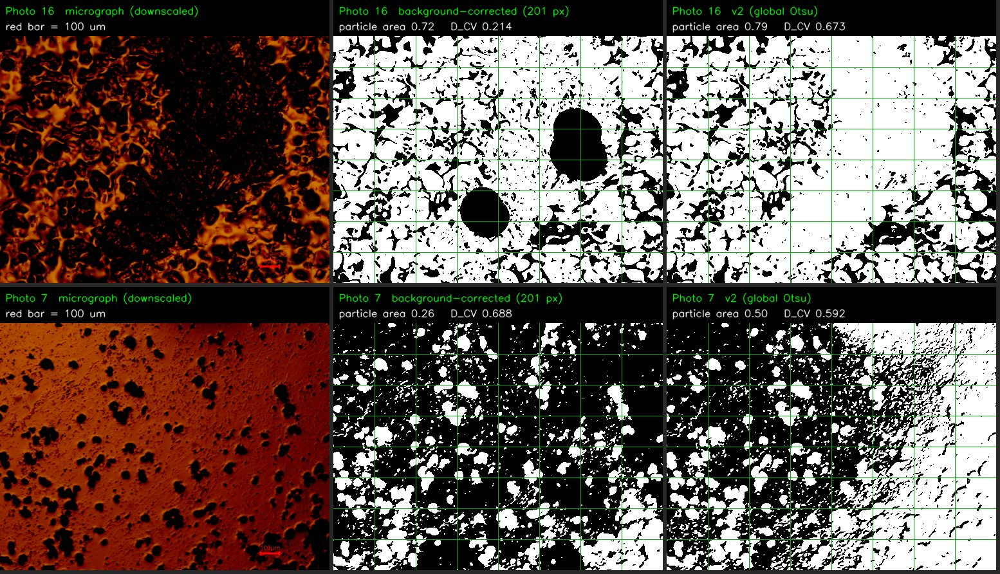

# dcv-vision

**Measure spatial dispersion from a microscope image.**

A deterministic OpenCV pipeline that converts a PNG or JPEG micrograph into
**D_CV**, a measure of how unevenly particles or voids are distributed across
an 8 × 8 grid. Lower values mean more even coverage; higher values mean more
spatial variation. Values can exceed 1.

Use it as a Python function or through an optional local HTTP API. The core
analysis has no database, network, or application-framework dependency. It
was built for the same materials project as
[formulation-bo](https://github.com/mthogeon0731/formulation-bo).


*The example above is generated from synthetic images, not research photos.*

[Quick start](#quick-start) · [Python API](#python-api) ·
[HTTP API](#optional-http-api) · [D_CV definition](#how-d_cv-is-calculated) ·
[Real-micrograph check](#real-micrograph-check) · [Tests](#tests) ·
[Security](SECURITY.md)

## What changed in v2

Real-photo observations motivated changes to particle selection, large
aggregate detection, and the handling of dense samples. The
[real-micrograph check](#real-micrograph-check) records those observations,
including a segmentation failure under uneven illumination that v2 still has.

| Area | Previous behavior | Definition v2 |
|---|---|---|
| Particle selection | Automatic bright/dark detection | Explicit `"dark"` or `"bright"`; default: `"dark"` |
| Segmentation | Top-hat/black-hat background correction, then Otsu | Global Otsu after blur and polarity selection |
| Image scale | Fixed 1024-pixel long edge | Supported scale-bar normalization, with fixed-size fallback |
| Dense samples | Particle-fraction CV only | Void-fraction CV when particle coverage exceeds 50% |
| Result metadata | No definition-version field | `dcv_version=2` and `minority_phase` |

**v1 and v2 values are not directly interchangeable.** Reanalyze original
images with the same definition and acquisition conditions before combining
datasets. See [Migration from v1](#migration-from-v1) and the
[changelog](CHANGELOG.md).

## Quick start

Requires **Python 3.12 or later** for the pinned dependencies.

```bash
git clone https://github.com/mthogeon0731/dcv-vision
cd dcv-vision
python -m venv .venv
```

Activate the environment for your platform:

| Platform | Command |
|---|---|
| Windows PowerShell | `.\.venv\Scripts\Activate.ps1` |
| macOS / Linux | `source .venv/bin/activate` |

Then install and run the synthetic demo:

```bash
python -m pip install -r requirements.txt
python demo.py
```

The demo writes `demo_dispersion.png`. With the pinned versions:

| Synthetic fixture | D_CV |
|---|---:|
| Uniform particle placement | ≈ 0.0031 |
| Clustered particle placement | ≈ 3.9167 |

These numbers illustrate the metric; they are not real-photo accuracy results.

## Python API

```python
from pathlib import Path
from dcv_vision import analyze_micrograph

result = analyze_micrograph(
    Path("micrograph.jpg").read_bytes(),
    particles="dark",
)

print(result["d_cv"])
print(result["dcv_version"], result["minority_phase"], result["polarity"])
```

Choose `particles="dark"` for dark particles on a brighter background, or
`particles="bright"` for bright particles on a darker background. There is
no automatic polarity mode.

| Result field | Meaning |
|---|---|
| `d_cv` | Quadrat coefficient of variation, rounded to four decimals |
| `dcv_version` | Measurement definition; currently `2` |
| `minority_phase` | `"particle"` or `"void"`: the phase used to calculate CV |
| `area_fraction` | Overall **particle** coverage, even when the metric uses voids |
| `n_grid` | Grid size per side; currently `8` |
| `polarity` / `polarity_evidence` | Selected particle polarity and a readable explanation |
| `processed_image_base64` | Base64-encoded JPEG mask preview, maximum long edge 512 px |
| `original_width` / `original_height` | Input image dimensions in pixels |

The function returns a dictionary without storing the input or result.
It raises `ValueError` for invalid input and `VisionAnalysisError` when
meaningful particles cannot be detected.

## Optional HTTP API

Start the local server:

```bash
uvicorn api:app --host 127.0.0.1
```

In another terminal, send a multipart request:

```bash
curl -F "file=@micrograph.jpg" -F "particles=dark" http://127.0.0.1:8000/analyze-microscope
```

On Windows PowerShell, use `curl.exe` if `curl` resolves to a PowerShell alias.
The response contains the same fields as the Python API.

| Status | Meaning |
|---|---|
| `200` | Analysis completed |
| `400` | Invalid image input or particle polarity |
| `413` | Total request body exceeds 10 MiB, including multipart overhead |
| `422` | Low-contrast/no-particle image, or a missing required file |

The wrapper is intended for **local or trusted use**. It has no authentication
or rate limiting. The framework may temporarily spool uploads to disk; the
application does not persist images or results. Deployment requirements and
the limits of image-input protections are documented in [SECURITY.md](SECURITY.md).

## How D_CV is calculated

For each grid cell, let `p_i` be the particle area fraction. Select the phase
using the overall particle coverage:

- Coverage **≤ 50%**: `q_i = p_i`, measuring particle fractions.
- Coverage **> 50%**: `q_i = 1 - p_i`, measuring void fractions.

```text
D_CV = std(q_i, ddof=0) / mean(q_i)
```

The calculation uses population standard deviation and does not clip the
result at 1. The implementation returns 0 if the selected phase has zero
mean coverage. Always inspect the mask when interpreting a measurement.

Using the minority phase makes the metric more sensitive to uneven empty
regions in dense samples, where particle fractions can approach saturation.

### Image processing

1. **Validate:** check PNG/JPEG headers and input resource limits.
2. **Normalize scale:** remove lower-right red annotations and use a
   supported scale bar; otherwise resize the long edge to 1024 px.
3. **Check contrast:** apply Gaussian blur and reject images with a
   99th-to-1st percentile grayscale range below 40.
4. **Segment:** apply global Otsu using the selected particle polarity.
5. **Clean and measure:** apply morphological opening, remove small
   components, and calculate the grid statistic.

### Acquisition assumptions

- **Scale bar:** a red bar in the bottom 15% and rightmost 40% of the image,
  assumed to represent **100 µm**. Its numeric label is not read.
  Normalization targets `1024 / 960` pixels per µm.
- **Sampling:** consistent magnification, field of view, and sampling protocol
  are still needed. Pixel normalization does not make different physical
  grid-cell sizes interchangeable.
- **Segmentation:** one grayscale particle phase with adequate contrast.
  Uneven illumination or multiple phases can invalidate global Otsu results.
  This happened on three real frames; see
  [Open failure: uneven illumination](#open-failure-uneven-illumination).
- **Cleanup:** the 3-pixel opening and 20-pixel minimum component area remain
  provisional settings for a reference capture setup. Validate masks for
  your own optics.

## Real-micrograph check

The v2 changes came from running the pipeline on 19 real optical micrographs
and comparing its masks and numbers with what an observer saw in the photos.
This section records the process, the results, and one failure that is still
open.

Two of the photographs are shown below as downscaled copies. The other 17
are not included in this repository (see [SECURITY.md](SECURITY.md)), so
these numbers cannot be regenerated from it. Read them as the record of a
small check, not as a benchmark or an accuracy claim.

### Photos and reference judgments

- **Format:** 19 JPEG exports, 2048 × 1536 px, each with the microscope
  software's red 100 µm scale bar in the lower-right corner.
- **Magnifications:** three, told apart by the length of that bar: 128–130 px
  (13 photos), 233–234 px (5 photos), and 436 px (1 photo).
- **Comparison set:** the 13 photos at the lowest magnification, numbered
  7–19 below. They show dark particles in a brighter matrix. The field of
  view is about 1.59 × 1.19 mm, so one cell of the 8 × 8 grid covers about
  198 × 149 µm.
- **Other frames:** one empty field (photo 3), used to test rejection, and
  five frames at the two higher magnifications with no visual reference.

One observer gave two judgments by eye:

1. An ordering of the 13 photos by how much particle they contain.
2. Photo 16 contains one large aggregate and is the most clustered of the set.

The observer also agreed with the order that an intermediate pipeline
proposed for the remaining photos, within groups of similar particle amount.
Agreeing with a suggested order is weaker evidence than ranking
independently, so that agreement is not used as a score below.

Correlations below are Spearman rank correlations (ρ) against the first
judgment.

### Step 1: the previous pipeline (v1)

| Check | Result |
|---|---|
| Empty field | Returned D_CV = 6.90 at area fraction 0.001. The only detected "particle" was the red scale bar. |
| Polarity | 9 of the 13 photos were classified as bright particles, so the matrix was measured instead of the particles. That covers all eight of the fullest frames and one of the five sparsest. |
| Particle amount | Area fraction ran against the observer's ordering (ρ = −0.46). |
| Magnification | All three magnifications were resized to the same pixel width, so pixel-sized kernels covered different physical lengths. |

### Step 2: an intermediate pipeline (never published)

This attempt kept background correction and changed four things:

- The caller states the particle polarity.
- The red overlay is inpainted away, and its length rescales the image to
  `1024 / 960` pixels per µm.
- A contrast gate rejects empty fields.
- The black-hat kernel grows from 51 px to 201 px (188 µm at the normalized
  scale), because 51 px hollowed out anything larger than a single particle.

Results:

- The empty field was rejected, and area fraction followed the observer's
  ordering (ρ = +0.91).
- D_CV correlated with the same ordering at ρ = −0.94. That is not evidence
  about dispersion. It shows that particle-fraction CV shrinks as a frame
  fills up.
- Photo 16, the frame judged most clustered, received the fifth-lowest D_CV
  of the 13 (0.214). Its aggregate is wider than the kernel, so the interior
  was removed from the mask as background (figure, top middle).

### Step 3: definition v2

- **Global Otsu** replaces background correction and keeps the aggregate in
  the mask (figure, top right).
- **Minority-phase CV** restores sensitivity in full frames, where particle
  fraction is close to its upper bound and has little room to vary. On the
  v2 masks of the five fullest frames, particle-fraction CV is 0.177 for
  photo 16 against 0.107–0.159 for the other four. Void-fraction CV is 0.673
  against 0.435–0.564.



*Two of the real micrographs (left, downscaled) with their binary masks under
background correction (middle) and under v2 (right). White is detected
particle, and the green lines are the 8 × 8 grid. Top: the frame with a
large aggregate. Bottom: a sparse frame with uneven illumination.*

### v2 results on the comparison set

Rows are in the observer's particle-amount order, least to most. The last
column comes from viewing each mask beside its photo at reduced size. It is
not one of the observer's judgments.

| Photo | Particle area fraction | Phase used | D_CV | Mask against the photo |
|---:|---:|---|---:|---|
| 7 | 0.50 | void | 0.592 | Wrong: darker side of the frame marked as particle |
| 8 | 0.48 | particle | 0.453 | Wrong: same failure |
| 9 | 0.55 | void | 0.453 | Wrong: same failure |
| 11 | 0.43 | particle | 0.408 | Follows the particles |
| 15 | 0.44 | particle | 0.321 | Follows the particles |
| 19 | 0.57 | void | 0.329 | Follows the particles |
| 10 | 0.58 | void | 0.339 | Follows the particles |
| 12 | 0.58 | void | 0.340 | Follows the particles |
| 17 | 0.73 | void | 0.435 | Follows the particles |
| 14 | 0.79 | void | 0.485 | Follows the particles |
| 13 | 0.84 | void | 0.564 | Follows the particles |
| 16 | 0.79 | void | 0.673 | Follows the particles; aggregate retained |
| 18 | 0.78 | void | 0.481 | Follows the particles |

### What the check supports

- **Particle labelling.** Area fraction now describes the particles. It
  follows the observer's ordering at ρ = +0.87 across all 13 photos, and at
  ρ = +0.90 across the ten whose masks follow the particles.
- **Empty-field rejection.** The empty field has a 99th-to-1st percentile
  range of 30, below the gate of 40. The lowest value among the other 18
  frames is 55.
- **Large aggregates.** The aggregate stays in the mask, and photo 16 has the
  highest D_CV of the 13.
- **Scale-bar detection.** The bar was found in all 19 frames and separated
  the three magnifications.

### Open failure: uneven illumination

Photos 7–9 are the three sparsest frames, and each has a visible brightness
gradient across the field. Global Otsu assigns the darker side of the frame
to the particle class (figure, bottom right). In photo 7 the right third of
the frame is 84% "particle", against 26% with background correction, and the
overall area fraction rises from 0.26 to 0.50. The v2 D_CV values for these
three frames describe the lighting, not the particles.

Background correction segments these frames correctly but hollows out large
aggregates. Global Otsu does the reverse. Neither is correct on all 13
photos, and v2 does not yet resolve this. Until it does, use evenly lit
frames and inspect every mask before using its number.

### What the check does not establish

- **Sensitivity to dispersion.** Photo 16 is the only independent visual
  judgment of clustering. Whether D_CV separates samples with the same
  particle amount but different dispersion is untested.
- **Comparability across particle amounts.** D_CV depends on coverage, and the
  phase rule switches at 50%. Compare frames only at similar coverage.
- **Repeatability.** The check has one observer, 13 photos, one
  magnification, and no repeat fields of a single sample.
- **A large numerical change from v1 at this magnification.** On the 13
  photos, v2 D_CV stays close to v1 D_CV (ρ = +0.95, median absolute
  difference 0.026, maximum 0.077), because v1's automatic polarity usually
  picked the thinner phase, which v2 now selects by rule. At the other two
  magnifications the difference reaches 0.30, so the two definitions remain
  non-interchangeable.
- **A strong effect of `particles` on D_CV.** Swapping the polarity changes
  D_CV by at most 0.019 on the 18 analyzable frames. It mainly changes
  `area_fraction` and `minority_phase`.

## Migration from v1

1. Pass particle polarity explicitly, especially `particles="bright"` for
   bright-particle images; omitted polarity now means dark particles.
2. Save `dcv_version`, `minority_phase`, and `polarity` with each measurement.
3. Reanalyze original images before pooling previous and new results.
4. Recheck masks and update downstream thresholds or models for the new
   definition rather than assuming old numerical cutoffs still apply.

## Tests

```bash
python -m pip install -r requirements-dev.txt
python tests/test_dcv.py
python tests/test_v2_security.py
```

The suite contains 12 baseline scenarios and 27 additional regression tests.
Fixtures are generated in memory and cover measurement ordering, determinism,
explicit polarity, dense samples, large aggregates, scale-bar behavior,
malformed images, resource limits, HTTP body limits, and metadata exclusion
from result previews.

The pinned environment was verified on Windows with Python 3.12. Other
operating systems have not been execution-tested for this update.

## License

[MIT](LICENSE).
